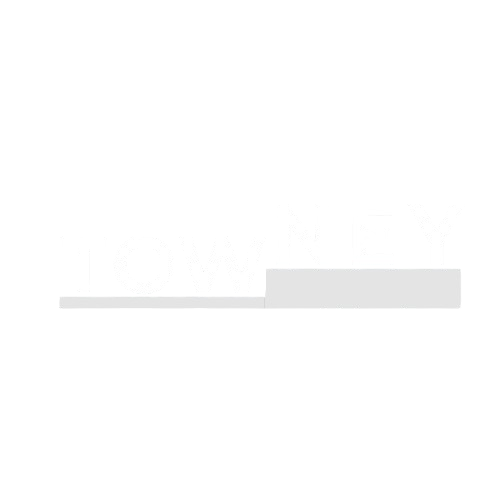

# Towney Web Application
<p align="center">

  
</p> 

Towney is an innovative platform that helps you find and connect with top production teams to turn your scripts and ideas into reality. Whether you're working on a film, advertisement, or any media project, Towney simplifies the process of bringing your vision to life.

## Features

- **Find Production Teams**: Discover top-rated teams and individuals to work with on your project.
- **Connect & Collaborate**: Seamlessly communicate with teams and keep all your collaboration efforts in one place.
- **Manage Projects**: Track progress, timelines, and milestones from start to finish.
- **Real-Time Updates**: Stay updated with project developments and changes through live notifications.

## Technologies Used

- **Frontend**: React.js, Tailwind CSS
- **Backend**: Node.js, Express.js, MongoDB
- **Hosting**: Vercel
- **Database**: MongoDB

## Getting Started

To get a local copy of the Towney Web Application up and running, follow these steps.

### Prerequisites

Ensure you have the following installed on your system:

- Node.js (version 14 or higher)
- MongoDB

### Installation

1. Clone the repository:
    ```bash
    git clone https://github.com/Hashara13/Towney-WebApplication.git
    ```

2. Navigate to the project directory:
    ```bash
    cd Towney-WebApplication
    ```

3. Install the dependencies:
    ```bash
    npm install
    ```

4. Set up the MongoDB database connection in `.env`:
    ```bash
    MONGO_URI=mongodb://localhost:27017/towney
    ```

5. Run the development server:
    ```bash
    npm run dev
    ```

6. Open [http://localhost:3000](http://localhost:3000) to view it in your browser.


